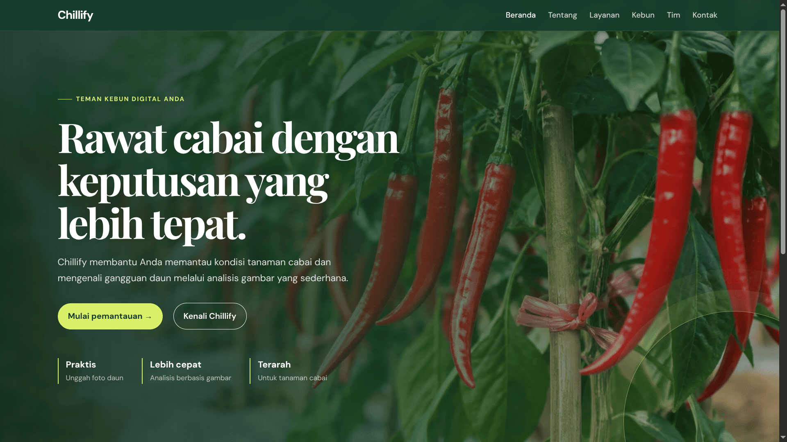
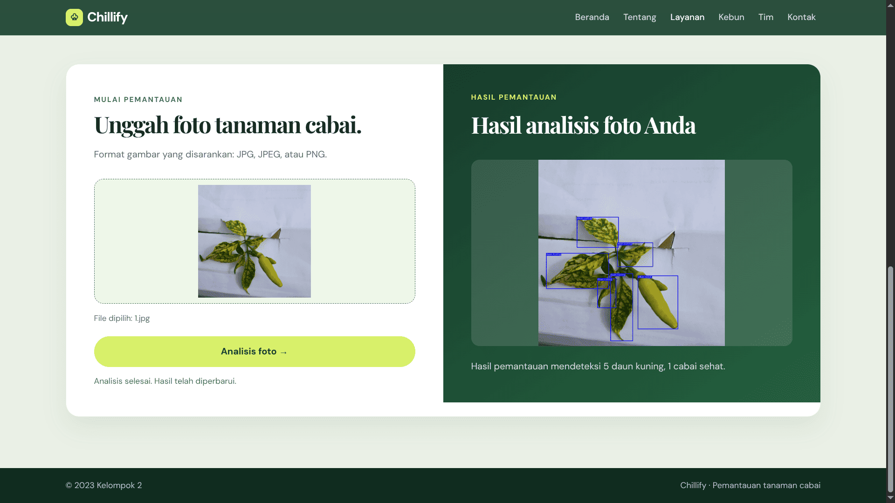

# 🌶️ Chillify

An AI-powered web application for detecting chili leaf diseases using **YOLO** and **Roboflow**. Users can upload an image of a chili leaf and receive an automated prediction with the detected disease class and confidence score.

> Developed as an Artificial Intelligence & Computer Vision project.

---

## Overview

Chillify helps identify diseases affecting chili plants from leaf images. The application integrates a Flask backend with a trained YOLO model served through Roboflow, providing a simple web interface for inference.

### Key Features

- 🔍 Chili leaf disease detection
- 📤 Image upload interface
- 🤖 YOLO-based object detection
- 📊 Confidence score for each prediction
- ⚡ Fast inference through Roboflow API
- 🌐 Lightweight Flask web application

---

## Tech Stack

| Category | Technology |
|----------|------------|
| Backend | Python, Flask |
| AI Model | YOLO |
| Model Serving | Roboflow |
| Frontend | HTML, CSS, JavaScript |
| Environment | python-dotenv |

---

## Project Structure

```text
Chillify/
├── app.py
├── requirements.txt
├── Procfile
├── .env.example
├── static/
├── templates/
├── assets/
└── README.md
```

---

## Installation

### 1. Clone the repository

```bash
git clone https://github.com/RifaAmrilSahputra/Chillify.git
cd Chillify
```

### 2. Create a virtual environment

```bash
python -m venv venv
```

Activate it:

**Windows**

```bash
venv\Scripts\activate
```

**Linux / macOS**

```bash
source venv/bin/activate
```

### 3. Install dependencies

```bash
pip install -r requirements.txt
```

### 4. Configure environment variables

Create a `.env` file based on `.env.example`.

Example:

```env
ROBOFLOW_API_KEY=your_api_key
```

### 5. Run the application

```bash
python app.py
```

Open your browser:

```text
http://127.0.0.1:5000
```

---

## Usage

1. Open the application.
2. Upload a chili leaf image.
3. Submit the image.
4. Wait for inference.
5. View the predicted disease and confidence score.

---

## 📸 Screenshots

### Home



### Prediction Result




---

## Model Information

| Item | Description |
|------|-------------|
| Model | YOLO |
| Task | Object Detection |
| Domain | Chili Leaf Disease Detection |
| Inference | Roboflow Hosted API |

> Update this section with your dataset size, classes, precision, recall, and mAP values if available.

---

## Future Improvements

- Local model inference
- Batch prediction
- Mobile-friendly interface
- Explainable AI visualization
- Model versioning
- Docker support
- REST API documentation

---

## Contributing

Contributions are welcome.

1. Fork the repository.
2. Create a feature branch.
3. Commit your changes.
4. Push to your branch.
5. Open a Pull Request.

---

## License

This project is licensed under the MIT License.

---

# 👨‍💻 Developer

### Amril Nadapdap

GitHub:
https://github.com/RifaAmrilSahputra

LinkedIn:
https://linkedin.com/in/rifaamrilsahputra

---

⭐ If you find this project useful, consider giving it a star.